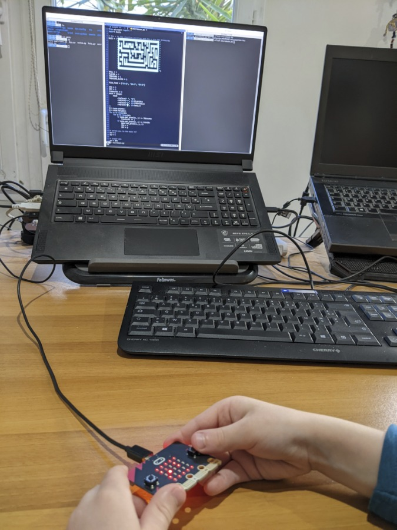

This is a micro game for the [microbit](https://microbit.org/).

To install it, fetch the repository, run

    uflash micromaze.py

You're into a maze, which you can't entirely see in the 5x5 screen.

Your goal is to fetch all the blinking treasures.
The remaining count is displayed at start and when fetching one.

You move by tilting the microbit: your avatar moves towards the bottom.

To make the game easier (and have an introduction to the code, kids can look at [the map](micromaze.py) while playing.

